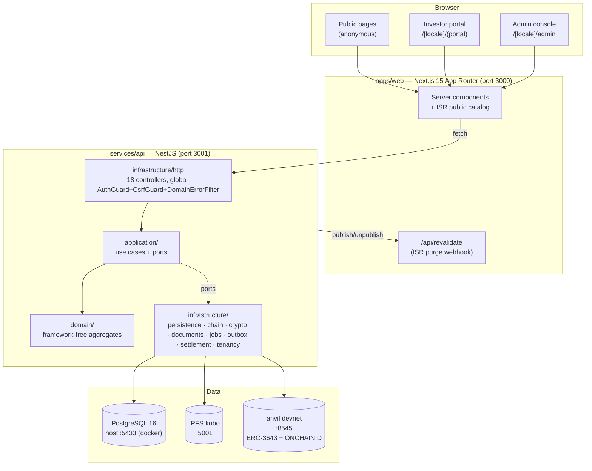

# ARCHITECTURE (as built, 2026-08-16 @ `e26f60f`)

This describes the architecture **that exists**, not an intended one. Anything aspirational is
labelled PLANNED.

---

## 1. System overview

**Dependency rule (enforced by review, not by a linter):** `domain` imports nothing from
`application` or `infrastructure`; `application` imports `domain` and its own port interfaces;
`infrastructure` implements ports and is wired **only** in the composition root
`services/api/src/app.module.ts`.

---

## 2. Component map

| Component | Responsibility | Technology | Key location |
|---|---|---|---|
| **Domain** | Business rules, state machines, invariants. No I/O | TypeScript, strict | `services/api/src/domain/**` |
| **Application** | Use cases orchestrating the domain; declares **ports** (interfaces) | TypeScript | `services/api/src/application/**` |
| **Infrastructure** | Adapters implementing ports: Prisma repos, ethers chain adapters, IPFS store, AES cipher, pg-boss scheduler, outbox drainer, HTTP controllers | NestJS, Prisma, ethers v6 | `services/api/src/infrastructure/**` |
| **Composition root** | The ONLY place ports meet adapters. ~1 800 lines of `useFactory` providers keyed by string DI tokens | NestJS `@Module` | `services/api/src/app.module.ts` |
| **Web** | Three surfaces in one Next.js app: public, investor portal, admin console | Next.js 15 App Router, React 19 | `apps/web/app/[locale]/**` |
| **Design system** | Hand-rolled components, zero UI dependencies | React + CSS | `apps/web/components/ui/**` |
| **Contracts** | AttestationRegistry + T-REX suite deployment helper | Solidity, Foundry | `contracts/src`, `contracts/script` |

---

## 3. Backend (`services/api`)

- **Framework:** NestJS 11 on Express. Entry point `src/main.ts`, module `src/app.module.ts`.
- **Language:** TypeScript `strict`, plus `exactOptionalPropertyTypes: true` and
  `noUncheckedIndexedAccess: true` — optional fields must be **omitted** (conditional spread),
  never set to `undefined`.
- **Module organisation:** a single `AppModule`. Providers are string-token factories
  (`ISSUER_REPOSITORY`, `PERSON_VERIFICATION`, `CLOCK`, `ID_GENERATOR`, …) so use cases stay
  free of decorators. Use-case classes are provided by class token.
- **API organisation:** 18 controllers under `src/infrastructure/http/`. Full route inventory is
  in `REPOSITORY_MAP.md`.

### Authentication

- Two principal kinds: `{kind:"investor", investorId}` and `{kind:"officer", officerId, roles?}`
  (`application/identity/ports.ts`).
- **Tokens:** JWT via `jose`, signed with `AUTH_TOKEN_SECRET` (`infrastructure/auth/jwt-token-service.ts`).
- **Two transports:** an httpOnly **session cookie** (browsers) and a **Bearer** header (service
  clients/tests). **Cookie wins when both are present** — this bit a test once; see KNOWN_ISSUES.
- **Passwords:** argon2 (`Argon2PasswordHasher`).
- **Brute-force:** per-account lockout (`LoginThrottleService`, persisted in `LoginAttempt`) plus
  a per-IP-per-path edge limiter (`AuthRateLimitGuard`, in-memory, 20 hits / 60 s).
- **MFA:** TOTP (otplib) for officers, **opt-in**, with recovery codes (`MfaEnrollment`).
- **Password reset & email verification:** single-use hashed tokens, mailed through the outbox.
- **Bootstrap officer:** `OFFICER_EMAIL` + `OFFICER_PASSWORD_HASH` env vars create a stable
  super-admin (`officer-1`); `OFFICER2_*` seeds a treasury user for real two-officer maker-checker.

### Authorization

- **Deny-by-default RBAC.** `application/identity/authorization.ts` defines 16 permissions and
  7 roles; `@RequirePermission(...)` on a controller/handler is checked by the global `AuthGuard`.
- Roles: `super_admin`, `platform_operator` (both = all staff permissions), `compliance_analyst`,
  `treasury`, `approver`, `auditor`, `investor`. Maker (`treasury`) and checker (`approver`) are
  **disjoint** on the money axis. The exact matrix is pinned by a test so any change is deliberate.
- **Resource-level authorization** exists where RBAC cannot express ownership:
  `IssuerTeamAccess` (membership of *this* issuer), portfolio "no position in asset" (403), and
  funding "not your request" (404).
- A legacy staff token without roles falls back to `platform_operator` (documented, tested).

### CSRF

`CsrfGuard` runs after `AuthGuard` (provider order) and challenges **cookie-authenticated**
mutations only; Bearer requests cannot be forged cross-site. The web client sends `x-csrf-token`.

### Multi-tenancy (OD-1a — "single-tenant install, tenant-ready schema")

- Every tenant-owned table carries `tenant_id`.
- `TenantContext` is an **AsyncLocalStorage** set by `tenant.middleware.ts` on every request.
- `tenantScopedPrisma()` returns a **Proxy** that injects the tenant filter at invocation time and
  **forbids `findUnique` / `update` / `upsert` / `delete`** (by-id operations that would escape
  the scope). Repositories therefore use `findFirst` / `updateMany` / `deleteMany` / `create`.
- Platform-level concerns (staff users, login attempts) use the **raw** `PrismaService`.
- Isolation is proven by `test/integration/tenant-isolation.test.ts`.

### Error handling

`DomainErrorFilter` (`infrastructure/http/domain-error.filter.ts`) is a global `@Catch()` filter
mapping ~95 domain/application error classes to HTTP status codes. Anything unmapped becomes a
**500 that is logged server-side while the client learns nothing**. `HttpException`s with status
≥ 500 are also logged — that omission once hid a CI failure for six runs.

### Background work

- **Transactional outbox** (`OutboxMessage` table) — side effects (emails) are enqueued in the
  same transaction as the state change and drained by an in-process interval drainer
  (`OUTBOX_DRAIN_INTERVAL_MS`), with attempt counters, backoff and dead-lettering.
- **pg-boss** (`infrastructure/jobs/pg-boss-job-scheduler.ts`) provides cluster-safe cron for the
  CRM follow-up-due scanner; enabled by `SCHEDULED_JOBS_ENABLED`. The outbox drainer deliberately
  stays on its own interval.

---

## 4. Frontend (`apps/web`)

- **Framework:** Next.js 15 App Router, React 19, TypeScript strict. **No UI dependencies at all**
  (`dependencies` = next, react, react-dom).
- **Routing:** `app/[locale]/…`, three groups:
  - `(public)` — homepage, `browse`, `browse/[id]`; server-rendered with **ISR**.
  - `(portal)` — investor: `portfolio`, `portfolio/[assetId]`, `offerings`, `funds`,
    `onboarding`, `profile`.
  - `admin` — `overview`, `ops`, `assets(/[id])`, `offerings(/[id])`, `distributions(/[id])`,
    `investors(/[id])`, `kyc`, `approvals`, `redemptions`, `registry`, `audit`, `deposits`,
    `security`.
  - Plus `reset-password` and `verify-email` screens and one route handler
    `app/api/revalidate/route.ts` (ISR purge, guarded by `REVALIDATE_SECRET`).
- **State management:** none beyond React state + server components. No Redux/Zustand/query lib.
- **API interaction:** `lib/api.ts` (authenticated, cookie-based, sends `x-csrf-token`) and
  `lib/public-api.ts` (anonymous, used by ISR pages). `lib/session.ts` holds the session shape,
  `lib/nav-visibility.ts` derives role-aware navigation, `lib/i18n.ts` the locale dictionary,
  `lib/format.ts` Rial/date formatting.
- **Auth in the browser:** httpOnly cookie; the client never sees the JWT.
- **Testing:** 41 Vitest + Testing Library files (`apps/web/test`), and Playwright specs in
  `apps/web/e2e` (`layout.spec.ts` layout contracts, `journey.spec.ts` the Phase-2 exit journey).

---

## 5. Database

- **PostgreSQL 16** (docker `tokenization-postgres`, host port **5433**), accessed via **Prisma**.
- Schema: `services/api/prisma/schema.prisma` — **43 models/enums**, listed in `REPOSITORY_MAP.md`.
- **28 migrations**, `20260710001437_init_investors` … `20260815090742_issuer_organisations`.
- **Migration workflow used throughout** (do not deviate):
  1. edit `schema.prisma`
  2. `prisma migrate diff --script` to generate SQL
  3. hand-write/review `migration.sql`
  4. `prisma migrate deploy`
  5. `prisma generate`
  6. drift check with `prisma migrate diff --exit-code` (0 = agree, 2 = drift)
- **Money** is stored as integer minor units in strings/BigInt — never floats.
- **Persistence conventions:** one Prisma repository per aggregate in
  `infrastructure/persistence/`, each implementing an application port, each covered by a shared
  **repository contract test** that also runs against the in-memory fake. That contract test has
  twice caught fields silently dropped by a repository.

---

## 6. Blockchain

| Aspect | Reality today |
|---|---|
| Network | **anvil** local devnet (`http://127.0.0.1:8545`), well-known test mnemonic. Besu stand-up is a pre-pilot gate, **not done** |
| Token standard | **ERC-3643 (T-REX)** via `@tokenysolutions/t-rex`, one token deployed **per asset** |
| Identity standard | **ONCHAINID** via `@onchain-id/solidity`; KYC approval issues an on-chain claim |
| Own contracts | `contracts/src/AttestationRegistry.sol` (anchors signed attestations), `contracts/src/TrexSuiteLib.sol` (suite deployment helper) |
| Deployment | `contracts/script/Deploy.s.sol` via `forge script`; it prints `ONCHAINID_CLAIM_ISSUER_ADDRESS=` and `ATTESTATION_REGISTRY_ADDRESS=` for the env |
| Dev addresses (public, non-secret, deterministic on a fresh anvil) | claim issuer `0x5FbDB2315678afecb367f032d93F642f64180aa3`, attestation registry `0xa85233C63b9Ee964Add6F2cffe00Fd84eb32338f` |
| Signing model | **One operator account** derived from `PLATFORM_OPERATOR_MNEMONIC`, used by every chain adapter. Custodial wallets are derived from the same mnemonic (`infrastructure/chain/custodial-wallets.ts`) |
| Nonce management | `LanedOperatorSigner` — a **shared promise lane per account** serialises sends, while **each send gets its own `NonceManager`**. Sharing one manager, or forcing a nonce re-read per send, were both tried and reverted (see DECISION_LOG) |
| Event indexing | `EthersTokenEventSource` reads Transfer events to rebuild the holder registry; no persistent indexer |
| Chain writes | **synchronous** inside the request. Moving them to workers is roadmap 1.6/PLANNED |
| Fallback | Without `DEVNET_RPC_URL`/mnemonic/claim-issuer configured, the API boots with `DevLogClaimIssuer` and a logging deployer so the app runs chain-less; the chain integration tests self-skip |

---

## 7. Infrastructure

- **Docker Compose** (`docker-compose.yml`): Postgres 16 (host 5433) and IPFS kubo (5001) only.
  The API, web and anvil run on the host.
- **CI** (`.github/workflows/ci.yml`, GitHub Actions, `ubuntu-latest`, 25-min timeout) runs on
  every push and PR: install → prisma generate → foundry → **lint → format → typecheck → forge
  test → API unit → web unit → build API → build web → migration deploy against an empty DB →
  start anvil → deploy contracts → integration suite → install Chromium → start API+web →
  Playwright layout + journey**. On failure it appends the API/web log tails to the job summary
  (job *logs* need admin rights; the **step summary does not** — this was a hard-won lesson).
- **Environment separation:** `.env.example` at `services/api/.env.example`; CI sets its own env
  block; there is **no staging or production environment yet**.
- **Storage:** IPFS for immutable **asset legal documents**; Postgres for everything else,
  including **AES-256-GCM-sealed KYC evidence** (deliberately *not* IPFS).
- **Queues:** pg-boss (cron) + the Postgres outbox (side effects).
- **Monitoring / observability:** **none** beyond Nest's logger and a `/reporting/health` probe.
- **Reverse proxy / hosting:** none configured. Deployment is undecided.
